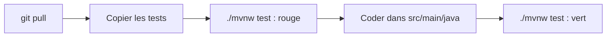

# Programmation Objet Avancée (Java)

Ce dépôt contient tout le matériel du cours : la configuration Maven, les exercices de chaque séance, les énoncés des TP et le sujet du projet. Vous le clonez **une seule fois**, puis vous le mettez à jour avec `git pull` au début de chaque séance.

## Pour commencer

Suivez [INSTALLATION.md](INSTALLATION.md). Votre installation est prête quand `./mvnw test` affiche `BUILD SUCCESS`.

## Organisation du dépôt

```
poa/
├── README.md             ce fichier
├── INSTALLATION.md       installation pas à pas et pièges courants
├── pom.xml               configuration Maven : Java 25, JUnit
├── mvnw, mvnw.cmd, .mvn/ Maven Wrapper : Maven s'installe tout seul
├── cours/cours-XX/       support, exercices et éventuelle correction de la séance XX
├── tp/tpX/               énoncé et tests fournis du TP X
├── projet/               sujet et cahier des charges du projet
└── src/
    ├── main/java/fr/poa/ votre code (cours01, tp1, …)
    └── test/java/fr/poa/ vos tests (copiés depuis cours/ et tp/)
```

Les dossiers `cours/`, `tp/` et `projet/` se remplissent au fil des séances.

## La règle d'or

- `src/` vous appartient : je n'y pousse jamais rien (à part `InstallationTest.java`, présent dès le départ).
- Ne modifiez **aucun** fichier en dehors de `src/`, pas même `pom.xml` : `git pull` refuse de mettre à jour un fichier que vous avez modifié.
- Les tests de `cours/` et `tp/` ne sont pas compilés tant qu'ils restent là : il faut les **copier** dans `src/test/java/`.

## Routine de chaque séance



1. Mettre à jour le dépôt :

```bash
   git pull
```

2. Copier les tests de la séance (exemple : cours 1).
   macOS / Linux :

```bash
   mkdir -p src/test/java/fr/poa/cours01
   cp cours/cours-01/exercices/*.java src/test/java/fr/poa/cours01/
```

Windows (PowerShell) :

```powershell
   New-Item -ItemType Directory -Force src\test\java\fr\poa\cours01
   Copy-Item cours\cours-01\exercices\*.java src\test\java\fr\poa\cours01\
```

3. Lancer les tests avec `./mvnw test`. Un test qui ne compile pas est un test rouge : c'est normal au départ.
4. Créer les classes demandées dans `src/main/java/fr/poa/cours01/`, d'abord avec des méthodes vides, puis les compléter jusqu'à `BUILD SUCCESS`.

Pour lancer une seule classe de test : `./mvnw test -Dtest=BilletVIPTest`.
Attention : tout `src/` est compilé d'un bloc. Un seul fichier qui ne compile pas bloque **tous** les tests.

| Terminal                    | Commande          |
| --------------------------- | ----------------- |
| macOS, Linux, Git Bash      | `./mvnw test`     |
| Windows PowerShell          | `.\mvnw.cmd test` |
| Windows Invite de commandes | `mvnw test`       |

## Rendre un TP

1. Votre code est dans `src/main/java/fr/poa/tpX/`. Les noms de classes et de méthodes sont imposés par l'énoncé : respectez-les à la lettre.
2. Chaque fichier commence par cet en-tête, avant la ligne `package` :

```java
   /*
    * NOM Prénom — N° étudiant : 12345678
    */
```

3. Vérifiez que `./mvnw test` affiche `BUILD SUCCESS`. La correction ajoute d'autres tests : si votre code empêche la compilation, la note de l'exercice est 0.
4. Créez le zip du dossier `tpX`, nommé `TPx_NOM_Prenom_NumEtudiant.zip`.
   macOS / Linux, depuis le dossier `poa` (sous Linux, `sudo apt install zip` si besoin) :

```bash
   cd src/main/java/fr/poa
   zip -r ~/TP1_NOM_Prenom_12345678.zip tp1
   cd -
```

Windows (PowerShell), depuis le dossier `poa` :

```powershell
   Compress-Archive -Path src\main\java\fr\poa\tp1 -DestinationPath $HOME\TP1_NOM_Prenom_12345678.zip
```

5. Envoyez-le par mail **avant** la séance suivante. Tout retard entraîne un malus.

## Évaluation

| Élément                      | Poids |
| ---------------------------- | ----- |
| 3 TP individuels             | 40 %  |
| Projet en groupe (AssurAuto) | 60 %  |

## Programme

| Séance | Contenu                                                                                               | Travail                                        |
| ------ | ----------------------------------------------------------------------------------------------------- | ---------------------------------------------- |
| S1     | Installation, rappel POO                                                                              | Sujet du projet, groupes                       |
| S2     | Modéliser : records, sealed, pattern matching, immutabilité, equals/hashCode, composition, exceptions | Lancement du TP1                               |
| S3     | Génériques et collections                                                                             | Atelier projet : modèle et répartition validés |
| S4     | Lambdas et streams                                                                                    | Lancement du TP2                               |
| S5     | Conception : SOLID, patterns, injection par constructeur, doublures de test                           | Jalon 1 du projet                              |
| S6     | Architecture en couches, JDBC (H2), fichiers                                                          | Lancement du TP3, avenant du projet            |
| S7     | Concurrence                                                                                           | Atelier projet final                           |
| S8     | Soutenances                                                                                           | Rendu du projet la veille                      |
