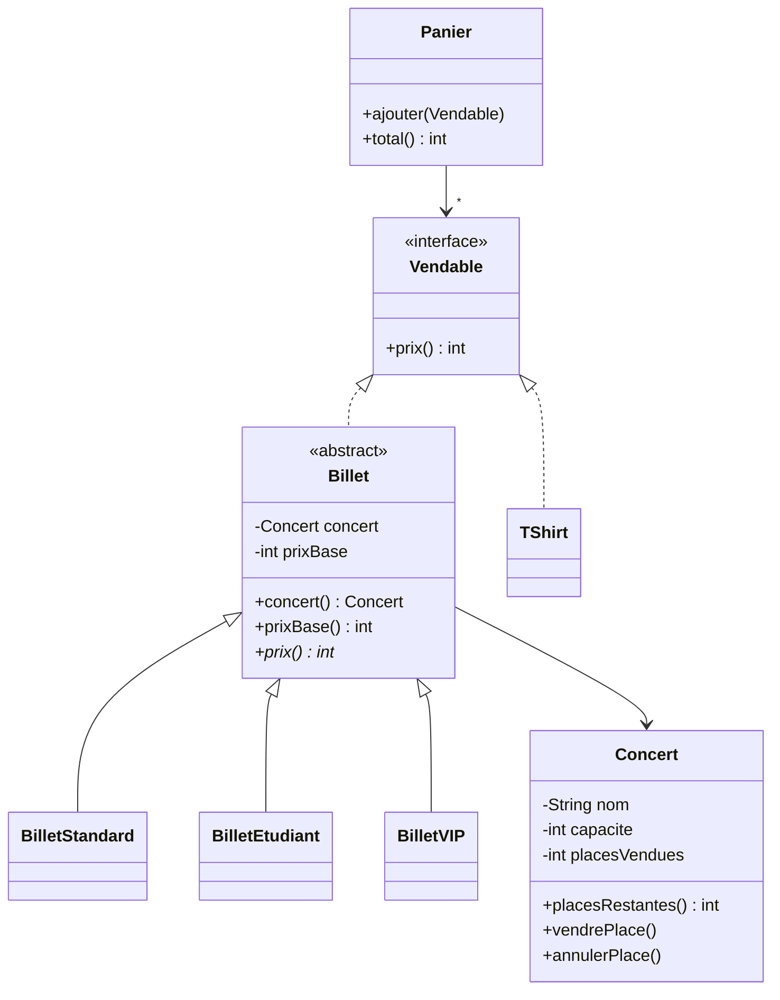

# Cours 1 — Exercices : rappel de POO

Fil rouge : une billetterie de concerts. Vous allez construire le modèle ci-dessous, question par question, en faisant passer les tests fournis.



## Règles

- Votre code va dans `src/main/java/fr/poa/cours01/`, package `fr.poa.cours01`.
- Les noms de classes, de méthodes et d'exceptions sont imposés : respectez-les à la lettre.
- Les prix sont en centimes, de type `int` (5000 = 50,00 €). Jamais de `double` pour de l'argent : `0.1 + 0.2` vaut `0.30000000000000004`.
- Quand un calcul tombe entre deux centimes, on arrondit au **centime inférieur**.

## Méthode, pour chaque question

1. Copiez le test indiqué dans `src/test/java/fr/poa/cours01/`, en remplaçant `NomDuTest`.
   macOS / Linux :

```bash
   mkdir -p src/test/java/fr/poa/cours01
   cp exercices/cours-01/tests/NomDuTest.java src/test/java/fr/poa/cours01/
```

Windows (PowerShell) :

```powershell
   New-Item -ItemType Directory -Force src\test\java\fr\poa\cours01
   Copy-Item exercices\cours-01\tests\NomDuTest.java src\test\java\fr\poa\cours01\
```

2. Lancez `./mvnw test` : le test ne compile pas. C'est un test rouge.
3. Créez les classes et les méthodes demandées, vides (une méthode `int` peut renvoyer `0`). Le test compile, puis échoue.
4. Codez jusqu'à `BUILD SUCCESS`.

Lisez toujours le test : il dit précisément ce qui est attendu.

À la fin de la séance, sauvegardez votre travail :

```bash
git add src
git commit -m "Cours 1 : exercices"
git push
```

## Exercice 1 — Concert : un objet protège ses règles

### Question 1 — Créer un concert

Test : `ConcertCreationTest.java`

Créez la classe `Concert` :

- un constructeur `Concert(String nom, int capacite)` ;
- une méthode `int placesRestantes()` : un nouveau concert a toutes ses places libres ;
- une capacité nulle ou négative est refusée par une `IllegalArgumentException` ;
- tous les attributs sont `private`, et aucune méthode ne commence par `set`.

<details>
<summary>Indice</summary>

Trois attributs : le nom et la capacité ne changent jamais (`final`) ; le nombre de places vendues, si. Vérifiez la capacité **avant** d'affecter les attributs, avec `throw new IllegalArgumentException("...")`.

</details>

### Question 2 — Vendre une place

Test : `ConcertVenteTest.java`

Ajoutez `void vendrePlace()` : une place de moins. Si le concert est complet, la vente est refusée par une `IllegalStateException`, et le nombre de places restantes ne change pas.

<details>
<summary>Indice</summary>

Réutilisez `placesRestantes()`. `IllegalArgumentException` signale un argument invalide ; `IllegalStateException`, une opération que l'état de l'objet interdit. Contrôlez avant de modifier.

</details>

### Question 3 — Annuler une place

Test : `ConcertAnnulationTest.java`

Ajoutez `void annulerPlace()` : une place redevient disponible. L'annulation est impossible si aucune place n'a été vendue : `IllegalStateException`.

### Question 4 — Même état, même objet ?

Test : `ConcertIdentiteTest.java`

Ce test passe sans écrire de code. Avant de le lancer, lisez-le et répondez :

1. Pourquoi `a` et `b` ne sont-ils pas le même objet ?
2. Pourquoi `a.equals(b)` est-il faux, alors que les deux concerts ont le même état ?
3. Pourquoi `a.placesRestantes()` vaut-il 499, alors que la place a été vendue par `c` ?

## Exercice 2 — Les billets : classe abstraite, héritage, polymorphisme

### Question 5 — Billet et billet standard

Test : `BilletStandardTest.java`

Créez :

- la classe abstraite `Billet` :
  - deux attributs : le concert (`Concert`) et le prix de base (`int`, en centimes) ;
  - un constructeur `protected Billet(Concert concert, int prixBase)` ;
  - deux accesseurs, `Concert concert()` et `int prixBase()` ;
  - une méthode abstraite `int prix()` ;
- la classe `BilletStandard`, qui étend `Billet` : son prix est le prix de base.

<details>
<summary>Indice</summary>

Le constructeur de `BilletStandard` appelle celui de `Billet` avec `super(concert, prixBase)`. Annotez `prix()` avec `@Override` : le compilateur vérifiera que la méthode redéfinie existe bien.

</details>

### Question 6 — Billet étudiant

Test : `BilletEtudiantTest.java`

Créez `BilletEtudiant` : il coûte 30 % de moins que le prix de base, arrondi au centime inférieur.

<details>
<summary>Indice</summary>

Restez en `int` : multipliez d'abord, divisez ensuite. Dans l'autre ordre, la division entière fait perdre les centimes.

</details>

### Question 7 — Billet VIP

Test : `BilletVIPTest.java`

Créez `BilletVIP` : son prix vaut 1,5 fois le prix de base, arrondi au centime inférieur.

### Question 8 — Un même appel, des comportements différents

Test : `BilletPolymorphismeTest.java`

Ce test passe sans écrire de code. Répondez :

1. La boucle appelle `billet.prix()` sur des variables de type `Billet`. Quelle méthode `prix()` est exécutée à chaque tour, et qui le décide : le compilateur ou l'exécution ?
2. Qu'a-t-il fallu modifier dans cette boucle pour prendre en compte les billets VIP ?

## Exercice 3 — Vendre autre chose que des billets : interface

### Question 9 — Vendable

Test : `VendableTest.java`

La billetterie vend aussi des t-shirts. Un t-shirt n'est pas un billet, mais il se vend.

- Créez l'interface `Vendable`, avec la méthode `int prix()` (en centimes).
- Créez `TShirt`, qui implémente `Vendable` : son prix est de 25,00 €.
- Faites implémenter `Vendable` par `Billet`.

### Question 10 — Panier

Test : `PanierTest.java`

Créez `Panier` :

- `void ajouter(Vendable article)` ;
- `int total()` : la somme des prix des articles, 0 pour un panier vide.

Un même article peut être ajouté plusieurs fois.
