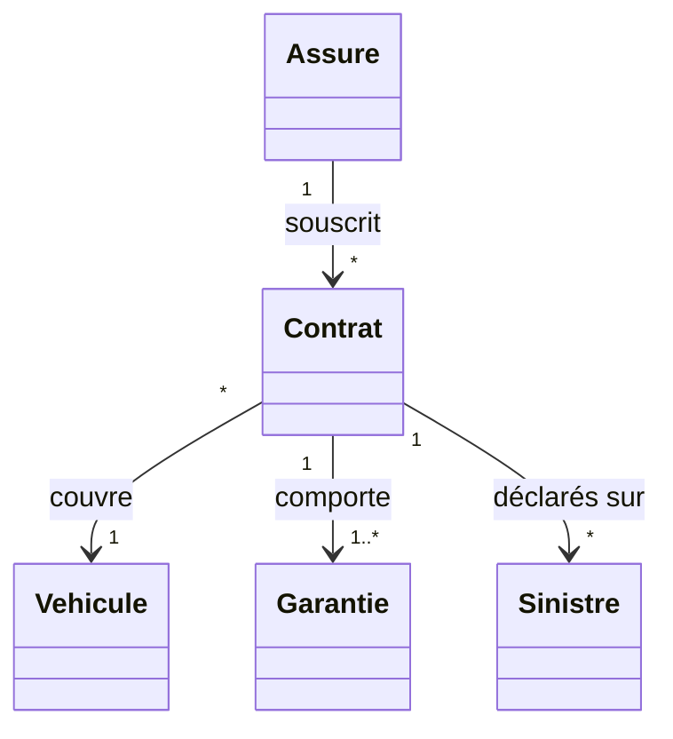
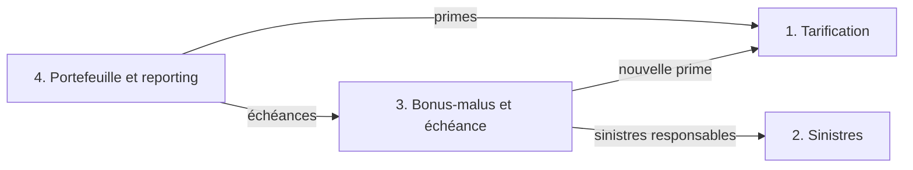

# Projet AssurAuto

Vous allez construire, en groupe, le cœur du logiciel de gestion d'un assureur automobile, en Java 25. Le projet compte pour **60 %** de la note finale.

## Le domaine

Un assuré souscrit un contrat pour un véhicule. Le contrat comporte des garanties. Des sinistres (accidents, vols…) sont déclarés sur un contrat. La prime annuelle dépend du véhicule, de la zone géographique, du conducteur et de son bonus-malus.



Les garanties possibles : responsabilité civile (RC), vol, bris de glace, tous risques.

Ce diagramme montre les concepts, pas les classes. Votre modèle de classes est à concevoir ; il est validé en séance 3.

### Le bonus-malus (règles simplifiées)

Le bonus-malus est un coefficient appliqué à la prime :

- il vaut 1,00 au départ ;
- il est multiplié par 0,95 pour chaque année sans sinistre responsable ;
- il est multiplié par 1,25 pour chaque sinistre responsable ;
- il est tronqué à 2 décimales ;
- il reste compris entre 0,50 et 3,50.

| Année  | Événement                  | Calcul               | Coefficient |
| ------ | -------------------------- | -------------------- | ----------- |
| Départ | —                          | —                    | 1,00        |
| 1      | Aucun sinistre responsable | 1,00 × 0,95 = 0,95   | 0,95        |
| 2      | Aucun sinistre responsable | 0,95 × 0,95 = 0,9025 | 0,90        |
| 3      | Un sinistre responsable    | 0,90 × 1,25 = 1,125  | 1,12        |
| 4      | Aucun sinistre responsable | 1,12 × 0,95 = 1,064  | 1,06        |

Comme pour les prix, pas de `double`. Le cahier des charges fixe la représentation du coefficient et les cas détaillés (plusieurs sinistres dans l'année, bornes…).

## Les quatre parties

Le **socle commun** (Assuré, Véhicule, Contrat, Garantie) est conçu ensemble. Chaque membre prend ensuite une partie :

| Partie                       | Responsabilités                                                                           |
| ---------------------------- | ----------------------------------------------------------------------------------------- |
| 1. Tarification              | Calculer la prime annuelle d'un contrat                                                   |
| 2. Sinistres                 | Déclarer un sinistre, établir la responsabilité, calculer l'indemnisation avec franchises |
| 3. Bonus-malus et échéance   | Faire évoluer le coefficient, renouveler ou résilier un contrat                           |
| 4. Portefeuille et reporting | Importer des contrats depuis un CSV, produire des statistiques et les avis d'échéance     |

Les parties dépendent les unes des autres :



C'est pourquoi chaque partie expose une **interface imposée**, donnée dans le cahier des charges. Chacun code et teste sa partie sans attendre les autres, en remplaçant au besoin leurs parties par des doublures (séance 5).

## Organisation

- Les groupes comptent 4 personnes et sont formés en séance 1. Chaque membre prend une partie.
- Chaque groupe a **son propre dépôt GitHub privé**, distinct de `poa`.
- Avant la séance 2, envoyez-moi par mail la composition du groupe (noms, numéros étudiants, partie de chacun) et le lien du dépôt.

### Mettre en place le dépôt du groupe

**Un seul membre** crée le dépôt. Le dossier `poa` doit être à côté (sinon, adaptez les chemins). Remplacez `NOM1-NOM2-NOM3` par les noms des membres, sans accent.

macOS / Linux :

```bash
mkdir assurauto-NOM1-NOM2-NOM3
cd assurauto-NOM1-NOM2-NOM3
cp -R ../poa/pom.xml ../poa/mvnw ../poa/mvnw.cmd ../poa/.mvn ../poa/.gitignore ../poa/.gitattributes .
```

Windows (PowerShell) :

```powershell
mkdir assurauto-NOM1-NOM2-NOM3
cd assurauto-NOM1-NOM2-NOM3
Copy-Item -Recurse ..\poa\pom.xml, ..\poa\mvnw, ..\poa\mvnw.cmd, ..\poa\.mvn, ..\poa\.gitignore, ..\poa\.gitattributes -Destination .
```

Puis, sur tous les systèmes :

```bash
git init -b main
git config pull.rebase false
git add .
git update-index --chmod=+x mvnw
git commit -m "Initialisation du projet"
gh repo create assurauto-NOM1-NOM2-NOM3 --private --source=. --remote=origin --push
./mvnw test
```

`./mvnw test` doit afficher `BUILD SUCCESS` (il n'y a encore aucun test).

Sur GitHub, dans _Settings > Collaborators > Add people_, invitez chaque membre du groupe et **ounzin** (moi) :).

**Les autres membres**, après avoir accepté l'invitation :

```bash
gh repo clone COMPTE/assurauto-NOM1-NOM2-NOM3
cd assurauto-NOM1-NOM2-NOM3
git config pull.rebase false
```

### Travailler à plusieurs

- Chacun travaille dans le package de sa partie : les conflits restent rares.
- Avant chaque `git push`, faites `git pull`.
- Commitez souvent, avec des messages clairs : l'historique montre qui a fait quoi.
- Chaque classe porte le nom de son auteur dans la balise `@author` :

```java
  /**
   * Calcule la prime annuelle d'un contrat.
   *
   * @author Marie DUPONT
   */
```

## Calendrier

| Moment                | Étape                                                |
| --------------------- | ---------------------------------------------------- |
| Séance 1              | Sujet, formation des groupes                         |
| Séance 3              | Modèle de classes et répartition des parties validés |
| Séance 5              | Jalon 1 : le socle et les tests de chaque partie     |
| Séance 6              | Avenant : des règles changent                        |
| Séance 7              | Atelier final                                        |
| Veille de la séance 8 | Rendu                                                |
| Séance 8              | Soutenances                                          |

L'avenant n'est pas annoncé à l'avance : concevez votre code pour qu'il puisse changer.

## Évaluation

| Critère                          | Points | Note         |
| -------------------------------- | ------ | ------------ |
| Tests de sa partie               | 6      | Individuelle |
| Soutenance de sa partie          | 6      | Individuelle |
| Qualité de conception et de code | 5      | Groupe       |
| Prise en compte de l'avenant     | 3      | Groupe       |
| **Total**                        | **20** |              |

12 points sur 20 sont individuels : chacun est noté sur sa partie. Les modalités des tests sont précisées dans le cahier des charges.

## Soutenance

20 minutes par groupe :

1. une démonstration ;
2. une modification en direct, faite par chaque membre sur sa partie ;
3. des questions individuelles.

Chacun doit maîtriser le code de sa partie.

## Rendu

La veille de la séance 8, envoyez par mail :

- le lien du dépôt GitHub ;
- un zip du dépôt, **avec le dossier `.git`**.

Le dépôt contient :

- un fichier `CONTRIBUTIONS.md` à la racine :

```markdown
| Nom    | Prénom | N° étudiant | Partie          |
| ------ | ------ | ----------- | --------------- |
| DUPONT | Marie  | 12345678    | 1. Tarification |
```

- la balise `@author` dans chaque classe.

Créer le zip, depuis le dossier qui contient le dépôt :

macOS / Linux :

```bash
cd assurauto-NOM1-NOM2-NOM3
./mvnw clean
cd ..
zip -r assurauto-NOM1-NOM2-NOM3.zip assurauto-NOM1-NOM2-NOM3
```

Windows (PowerShell) :

```powershell
cd assurauto-NOM1-NOM2-NOM3
.\mvnw.cmd clean
cd ..
tar -a -c -f assurauto-NOM1-NOM2-NOM3.zip assurauto-NOM1-NOM2-NOM3
```

## Documents

- `cahier-des-charges.md` : règles détaillées et interfaces imposées.
